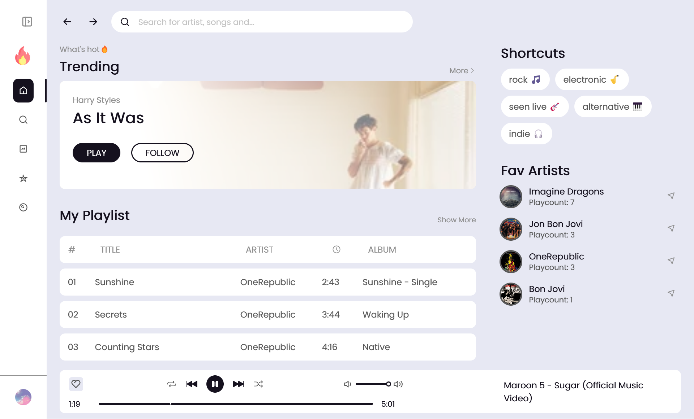

# NekiFM - Web Player for last.FM listeners

#### URL https://neki-fm.vercel.app/

#### A Music Player website with Front-End development.

## What to expect

## Features

-  Player Control: play/pause, next/previous, repeat-single/all/none, shuffle, increase/decrease volume, show time-stamp
-  Multiple pages: Home, Search, Trend, Artists, Songs, Tags (Genres)
-  Good URL structure, navigating between pages flexibly
-  Beautiful UI, good UX experience.

#### (Other good features can be seen in live version)

## Built with

-  HTML/CSS/JavaScript
-  ReactJs, Redux, Router V6, Styled Component
-  Last.fm API, Iframe Youtube API

## Contact me: phamthang11782@gmail.com

#### It's my pleasure to work with you 😊
